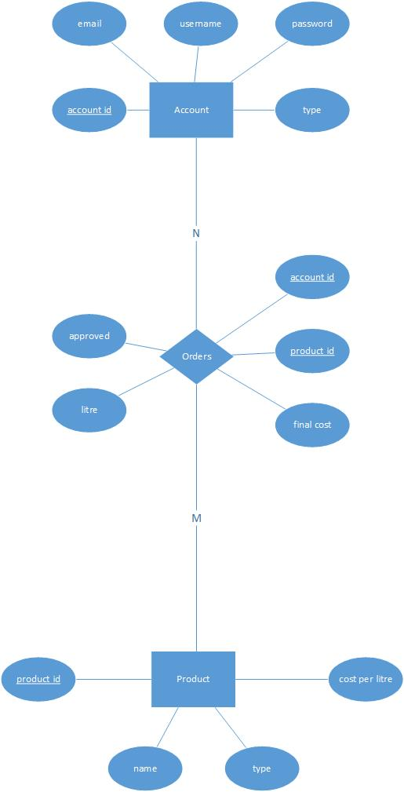
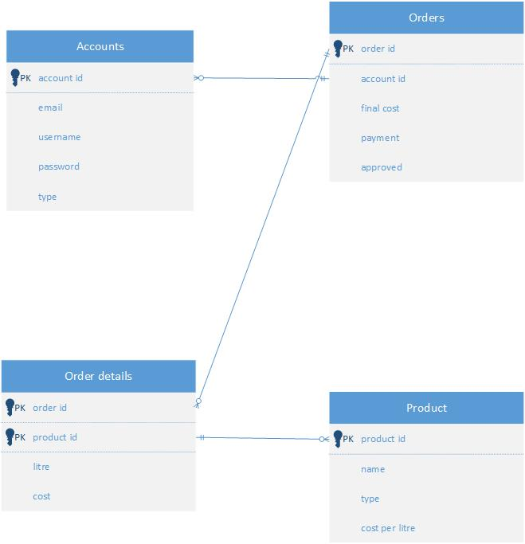
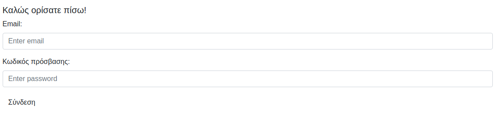

# Ηλεκτρονικό κατάστημα πώλησης οίνου

Στο παρακάτω έγγραφο καλύπτεται η πρώτη εργασία για το μάθημα <<Ηλεκτρονικό Εμπόριο και Επιχειρηματικοτητα>>.

## Θέμα εργασίας

Το θέμα της εργασίας ήταν η δημιουργία ενός ηλεκτρονίκου καταστήματος για την πόλωση οίνου. Η ιστοσελίδα έπρεπε να ήταν δυναμική και να παίρνει τα δεδομένα του από μία βάση δεδομένων. Οι τεχνολογίες που χρησιμοποιήθηκαν είναι οι εξής:

- **HTML** και **CSS** για την εμφάνιση της ιστοσελίδας, με την ενίσχυση του **Bootstrap**.
- **Javascript**, με τη χρήση της βιβλιοθήκης **jQuery** για το χτίσιμο του UI. Για την επικοινωνία μεταξύ Server και Client, χρησιμοποιήθηκε το **Ajax**.
- **PHP** για το back end κομματί της εφαρμογής και για την σύνδεση με την βάση.
- **MySQL** και συγκεκρίμενα τη **MariaDB**, για την αποθήκευση των δεδομένων σε μία βάση.

Η ανάπτυξη της εφαρμογής έγινε σε περιβάλλον **Linux** και συγκεκριμένα στο **Manjaro** distribution του Arch Linux. Το αρνητικό με αυτό είναι ότι δε δουλεύει το xampp, όπως δουλεύει σε άλλα distributions ή και στα Windows, επειδή δεν υποστήριζετε από τα Arch-based Linux. Παρόλα αυτά, για την εκτέλεση της εφαρμογής χρησιμοποιήθηκε η εξής εντολή για την εκτέλεση του προγράμματος.

```sh
php -S localhost:8080 -t app/
```

Η εντολή αυτή ανοίγει έναν server στο τοπικό μηχανάκι, στο port 8080. Δηλαδή, εάν ο τελικός χρήστης γράψει στον Browser του της επιλογής του στο url [localhost:8080](http://localhost:8080), τότε θα του ανοίξει η πρώτη σελίδα, η οποία είναι το **index.php**. Συνολικά υπάρχουν 4 σελίδες, από τις οποίες οι δύο εμφανίζονται σε όλους τους χρήστες και η μία μόνο στον διαχειριστή της σέλιδας. Οι τέσσερις σελίδες είναι οι εξής: [η αρχική σελίδα](app/index.php), [η σελίδα σύνδεσης](app/account.php), [το καλάθι του χρήστη](app/cart.php) και [η διαχειριστική σελίδα](app/cart.php).

## Σχεδιασμός βάσης

Ο σχεδιασμός της βάσης είχε δύο στάδια. Η πρώτη σκέψη ήταν η εξής:



Επειδή, από μια πρώτη σκέψη, αυτό φάνηκε σώστο, μέτα στη πράξη δε μπορούσε να χρησιμοποιήθει. Για αυτό τον λόγο, προστέθηκε ένα παραπάνω table με επιπρόσθετες πληροφορίες για τις παραγγελίες.



## Επεξήγηση κώδικα

Η επεξήγηση του κώδικα θα γίνει από την πιο απλή λειτουργία της εφαρμόγης, η οποία είναι η σύνδεση σε έναν υπάρχων λογαριασμό. Για την καλύτερη προσέγγιση και κατανόηση, θα αναλυθεί από πάνω προς τα κάτω, δηλαδή από την HTML στην PHP.

### HTML

Έστω ότι έχουμε το εξής τμήμα HTML κώδικα.

```html
<div class="loginDiv">
    <br>
    <h5>Καλώς ορίσατε πίσω!</h5>
    <div class="loginDiv">
        <div id="loginMessage"></div>
        <div class="form-group">
            <label for="email">Email:</label>
            <input type="email" class="form-control" id="email" placeholder="Enter email" name="email">
        </div>

        <div class="form-group">
            <label for="pwd">Κωδικός πρόσβασης:</label>
            <input type="password" class="form-control" id="pwd" placeholder="Enter password" name="pwd">
        </div>

        <button type="submit" id="login" class="btn btn-default">Σύνδεση</button>
    </div>
</div>
```

Αυτό επιστρέφει την εξής εμφάνιση στον τελικό χρήστη.



Ιδιαίτερη έμφαση πρέπει να δοθεί εδώ για τον τρόπο εισαγωγής των στοιχείων του χρήστη.

```html
<input type="email" class="form-control" id="email" placeholder="Enter email" name="email">
```

Να σημειωθεί το id του που είναι *email*. Από το id του input θα γίνει η σύνδεση με την Javascript και η ανάκτηση των πληροφορίων που έδωσε ο χρήστης (τα credentials του δηλαδή).

### Javascript

Εφόσον ο κώδικας της Javascript είναι πιο περίπλοκος από τον κώδικα της HTML, θα δοθεί παραπάνω σαφήνεια, γραμμή-γραμμή για το πως ανακτούνται τα credentials του χρήστη και πως γίνεται το HTTP Request για τη σύνδεση με το back end.

```js
$(document).ready(function() {
    $("#login").click(function() {
```

Αυτό εδώ είναι μία jQuery function, αφού ξεκίναει από το σύμβολο $ όπου όταν φορτώσει η HTML σελίδα, λειτουργεί μία συνάρτηση αυτόματα. Η σύναρτηση αύτη φορτώνει έναν action listener για το κουμπί με id *login*.

```js
var email = $("#email").val().trim();
var pwd = $("#pwd").val().trim();

if (email != "" && pwd != "") {
```

Στη συνέχεια, γίνεται η ανάκτηση των credentials του χρήστη και ελέγχεται άμα είναι άδεια. Αμά είναι άδεια, δε γίνεται κάτι. Διαφορετικά, πραγματοποίειται ένα HTTP Request με τη χρήση του Ajax.

```js
$.ajax({
    url: 'php/login.php',
    type: 'post',
    data: {
        email: email,
        pwd: pwd
    },
    success: function(res) {
        var msg = "";

        if (res == 1) {
            window.location = "index.php";
        } else {
            msg = "Invalid username or password";
        }

        $("#loginMessage").html(msg);
    }
})
```

To Ajax στέλνει ένα *POST* request στην σελίδα **login.php**, με πληροφόριες το email και τον κωδικό πρόσβασης. Στη συνέχεια, εάν είναι πετυχημένη η σύνδεση, χωρίς σφάλματα, θα δεχτεί δύο κωδικούς. Ο κωδικός <<1>> σήμαινει ότι η σύνδεση ήταν πετυχήμενη και κάνει αυτόματο redirect στην αρχική σελίδα, διαφορετικά εμφανίζει μήνυμα ότι η σύνδεση δεν ήταν πετυχημένη, λόγο λανθασμένων credentials.

### PHP

Ο κωδικάς του αρχείου login.php δεν είναι τίποτα το ιδιαίτερο. **ΣΗΜΕΙΩΣΗ**: ηταν η πρώτη επάφη με PHP, όποτε ενδέχεται ο κώδικας να μην έχει τις καλύτερες πρακτικές ή τον πιο optimized κώδικα.

```php
<?php
    require "db.php";
    if (getAccount($_POST['email'], $_POST['pwd'])) {
        echo 1;
    } else {
        echo 0;
    }
?>
```

Αυτό ουσιαστικά κάνει import το αρχείο **db.php**, όπου βρίσκετε μέσα η συνάρτηση *getAccount*. Το *\$_POST* γίνετε μόνο όταν δέχεται **POST** Request. Το αντίστοιχο για το **GET** είναι το *\$_GET*.

Η συνάρτηση *getAccount* είναι η εξής:

```php
function getAccount($email, $pwd) {
    $conn = initConn();

    if (!$conn) {
        die("Connection failed...".mysqli_connect_error());
    }

    $sql = "SELECT account_id, username, type FROM account
                WHERE email = '{$email}' AND password = '{$pwd}'";
    $result = mysqli_query($conn, $sql) or die(mysqli_error($conn));

    if (mysqli_num_rows($result) > 0) {
        while ($row = mysqli_fetch_assoc($result)) {
            session_start();
            $_SESSION['account_id'] = $row['account_id'];
            $_SESSION['username'] = $row['username'];
            $_SESSION['type'] = $row['type'];
        }

        return true;
    }
}
```

Χωρίς να υπερ-αναλυθεί, κάνει ένα query στην MySQL και κράταει στο *\$_SESSION* πληροφορίες που χρησιμοποίει σε διάφορα σημεία της εφαρμογής. Μία χρήση του *\$_SESSION* είναι στο navbar.

```html
<?php if (isset($_SESSION['type']) && $_SESSION['type'] == 'admin') {?>
    <li class="nav-item">
        <a class="nav-link" href="admin.php">Admin</a>
    </li>
<?php }?>
```

Αυτή την ιστοσελίδα την εμφανίζει μόνο όταν είναι συνδεδέμενος ο χρήστης σε έναν λογαριασμό και αυτός ο λογαριασμός είναι **admin**.

## Σχόλια

Μία προδιαγράφη της εφαρμογής ήταν να στέλνει αυτοματοποιημένα emails στον τελικό χρήστη. Παρότι βρέθηκε ένας τρόπος online, αυτός ο τρόπος δε δουλέψε και δεν υπήρχε αρκέτο μέγαλο περιθώριο χρόνου ώστε να βρεθεί κάποια λύση για αυτό. Παρολα αύτα, ο κώδικας υπάρχει ακόμα σε σχόλια στην εφαρμογή. Επιπρόσθετα, άμα ύπηρχε λίγο παραπάνω χρόνος, θα ύπαρχει και προσθήκη cookies στην εφαρμογή που είναι απαραίτητα για ένα ηλεκτρονικό κατάστημα, όπως και ένα σύστημα ανάκτησης του κωδικού προσβάσης άμα δουλεύε το email και κωδικοποίηση του κωδικού. Στην επόμενη εργασία του μαθήματος, θα υπάρχουν αύτες οι λειτουργίες.

Επιπρόσθετα, υπάρχει ένα περιέργο bug με το καλάθι αγορών, για το όποιο δε βρέθηκε λύση.

### Σύνδεση ως admin

Για να συνδεθεί οποίοσδηποτε θέλει να δοκιμάσει την εφαρμογή ως admin τα credentials είναι τα εξής:

- Email: **admin@kerkopoulos.gr**
- Password: **admin**

### Λογαριασμός της βάσης

Ο λογαριασμός για να δουλέψει η βάση είναι ο εξής:

- Username: **eshopuser**
- Password: **eshopuserpasswd**
